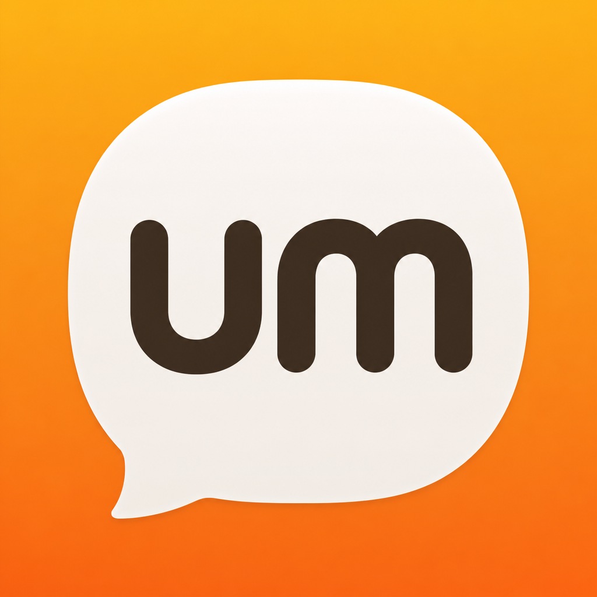
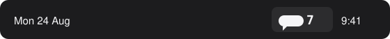

<p align="center">
  
</p>

<h1 align="center">Um</h1>

<p align="center">
  A tiny Mac menu bar app that counts your filler words.<br>
  Launch it. Talk. Watch the number go up.
</p>

<p align="center">
  <strong>On-device. No account. No subscription. Audio never leaves your Mac.</strong>
</p>

---

Most people have no idea how often they say *um*, *uh*, *like*, or *you know*. Um sits in the menu bar, listens locally, and shows a live count. That is the whole product.

## Install

**Requires macOS 13 or later.**

1. Download **`Um-1.0.0.dmg`** from [Releases](https://github.com/r3dbars/um/releases).
2. Open the disk image and drag **Um** into **Applications**.
3. **First launch:** right-click `Um.app` → **Open** → **Open**.

macOS Gatekeeper warns on the first launch because the GitHub build is ad-hoc signed (no Apple Developer ID in CI). After you use **Open** once, Spotlight and a normal double-click work.

If the app is still blocked after download:

```bash
xattr -dr com.apple.quarantine /Applications/Um.app
```

Then click the menu bar bubble. Allow the microphone when macOS asks. Um starts listening on its own.

<p align="center">
  
</p>

## What you get

| | |
| --- | --- |
| **Menu bar count** | A speech-bubble icon and a number. It flashes when a filler word lands. |
| **Popover** | Live totals per word, session length, and rate per minute. |
| **Custom words** | Add your own tics in Settings. |
| **History** | Past sessions with a rate trend so you can see if you are improving. |
| **Notifications** | Optional alert every N filler words. |
| **Launch at login** | Keep it running without thinking about it. |

Default words: `um`, `uh`, `like`, `you know`, `basically`, `literally`, `sort of`, `kind of`, `right`, `so`.

## Privacy

Audio is processed on this Mac. Um does not upload recordings, does not keep a transcript, and does not phone home.

The release build uses a bundled [whisper.cpp](https://github.com/ggml-org/whisper.cpp) `tiny.en` model so filler words like *um* and *uh* are not dropped. If that model is missing (for example a source checkout before `scripts/download-model.sh`), Um falls back to Apple’s on-device speech recognizer.

See [docs/PRIVACY.md](docs/PRIVACY.md).

## Build from source

On a Mac with Xcode 15+ or the Swift 5.9 toolchain:

```bash
git clone https://github.com/r3dbars/um.git
cd um
./scripts/download-model.sh    # ~75 MB, once
open Um.xcodeproj               # ⌘R
```

Or package a local `.app` and disk image:

```bash
./scripts/download-model.sh
./scripts/package-app.sh       # → dist/Um.app
./scripts/create-dmg.sh        # → dist/Um-1.0.0.dmg
```

`./run.sh` downloads the model if needed, builds with SwiftPM, and launches the binary for a quick debug loop.

## How it works

```
Menu bar  ──►  ListeningController
                    ├─ Whisper (default, verbatim fillers)
                    └─ Apple Speech (fallback)
                         │
                         ▼
                 WordMatcher  ──►  live count
                         │
                         ▼
                 SessionStore (optional history on disk)
```

Matching is word-boundary safe: *like* does not count inside *likewise*.

## Requirements

- macOS 13.0+
- Microphone permission
- Xcode 15+ only if you are building from source

## License

MIT. Free to use, fork, and ship.

---

*Part of [r3dbars](https://github.com/r3dbars) — small on-device voice tools for Mac.*
