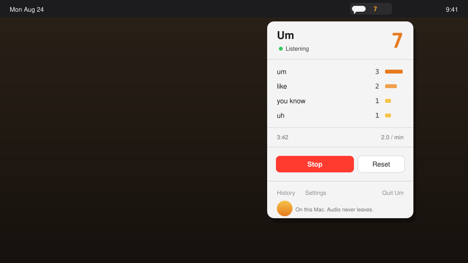

<p align="center">
  
</p>

<h1 align="center">Um</h1>

<p align="center">
  A Mac menu bar app that counts your filler words.<br>
  Launch it. Talk. Watch the number go up.
</p>

<p align="center">
  <strong>On-device. No account. No subscription. Audio never leaves your Mac.</strong>
</p>

<p align="center">
  <a href="https://github.com/r3dbars/um/releases/latest"></a>
  
  
</p>

<p align="center">
  
</p>

Most people have no idea how often they say *um*, *uh*, *like*, or *you know*. Um sits in the menu bar, listens locally, and ticks up. That is the whole product.

**[Download the latest DMG →](https://github.com/r3dbars/um/releases/latest)** · macOS 13+ · drag Um into Applications

<details>
<summary>First launch (ad-hoc signed build)</summary>

<br>

The GitHub build is not Developer ID signed, so Gatekeeper warns once.

1. Right-click `Um.app` → **Open** → **Open**.
2. Allow the microphone when macOS asks.
3. If it is still blocked: `xattr -dr com.apple.quarantine /Applications/Um.app`

After that, Spotlight and a normal double-click work. The current release disk image is Apple Silicon; the next tag is a universal `arm64` + `x86_64` build.

</details>

## What you get

- **A number in the menu bar** that flashes when a filler word lands
- **Per-word totals**, session length, and rate per minute
- **Your own list** — add the tics you actually say
- **History** so you can see if you are getting better
- **Optional alerts** every N filler words, and launch at login

Default words: `um`, `uh`, `like`, `you know`, `basically`, `literally`, `sort of`, `kind of`, `right`, `so`.

## Privacy

Audio is processed on this Mac. Um does not upload recordings, does not keep a transcript, and does not phone home. The release build uses a bundled [whisper.cpp](https://github.com/ggml-org/whisper.cpp) `tiny.en` model so *um* and *uh* stay in the transcript. [Privacy details](docs/PRIVACY.md).

## Build from source

macOS 13+ and Xcode 15+ (or the Swift 5.9 toolchain):

```bash
git clone https://github.com/r3dbars/um.git
cd um
./scripts/download-model.sh    # ~75 MB, once
open Um.xcodeproj               # ⌘R
```

```bash
./scripts/package-app.sh       # → dist/Um.app  (universal)
./scripts/create-dmg.sh        # → dist/Um-1.0.0.dmg
```

`./run.sh` is the debug loop. How counting works is in [docs/ARCHITECTURE.md](docs/ARCHITECTURE.md).

## License

MIT. Free to use, fork, and ship.

---

*Part of [r3dbars](https://github.com/r3dbars) — small on-device voice tools for Mac.*
